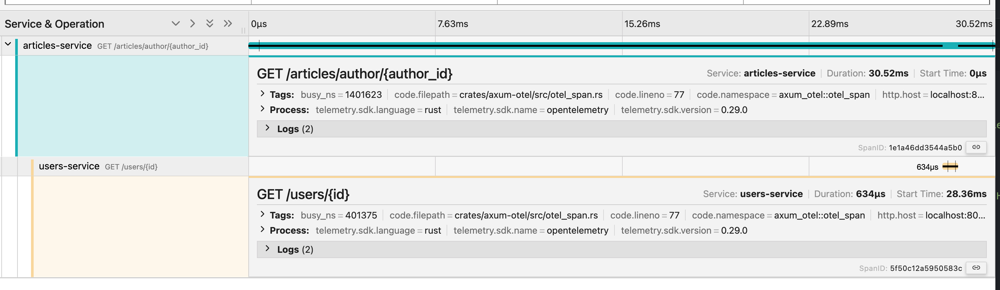

# Microservices

This directory contains a simple microservices example.

## Running the example

```bash
cargo run --p users-service
cargo run --p articles-service
```

## Accessing the services

### Create a user:
```bash
curl -X POST http://localhost:8081/users \
  -H "Content-Type: application/json" \
  -d '{"name": "John Doe", "email": "john@example.com"}'
```

### Create an article:
```bash
curl -X POST http://localhost:8082/articles \
  -H "Content-Type: application/json" \
  -d '{"title": "My First Article", "content": "This is the content of my first article", "author_id": 1}'
```

### Get all articles by author:
```bash
curl http://localhost:8082/articles/author/1
```

## Trace




