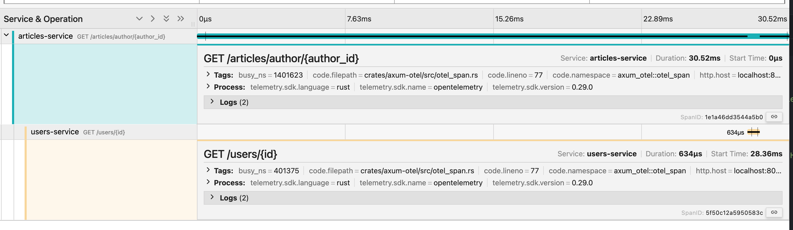
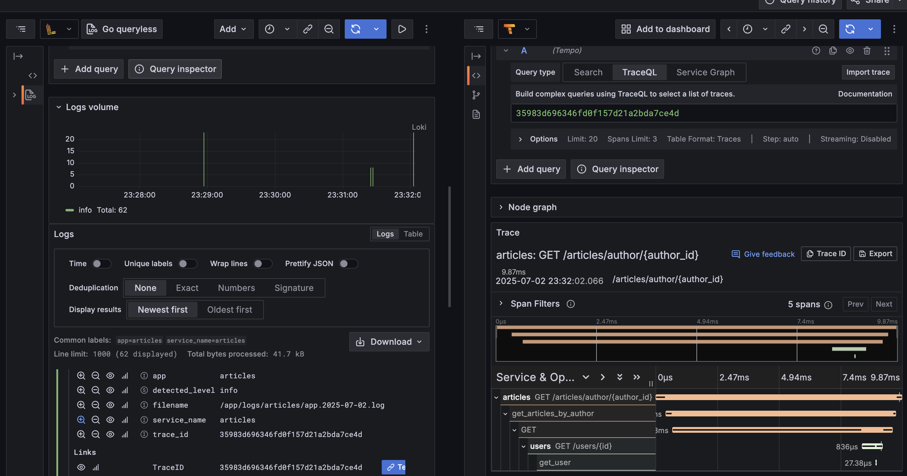

# Microservices Example

This directory contains a simple microservices example demonstrating how to use OpenTelemetry for distributed tracing and log collection.

## Project Overview

This project consists of two microservices:
- **users-service**: User management service (port 8081)
- **articles-service**: Article management service (port 8082)

The services communicate via HTTP calls and use OpenTelemetry for distributed tracing.

## Quick Start

### 1. Start Services

```bash
# Start user service
cargo run --package users-service

# Start article service
cargo run --package articles-service
```

### 2. Test Services

#### Create a user
```bash
curl -X POST http://localhost:8081/users \
  -H "Content-Type: application/json" \
  -d '{"name": "John Doe", "email": "john@example.com"}'
```

#### Create an article
```bash
curl -X POST http://localhost:8082/articles \
  -H "Content-Type: application/json" \
  -d '{"title": "My First Article", "content": "This is the content of my first article", "author_id": 1}'
```

#### Get all articles by author
```bash
curl http://localhost:8082/articles/author/1
```

## Monitoring Configuration

### Jaeger Distributed Tracing

#### Start Jaeger
```bash
docker run -d \
  -p 6831:6831/udp \
  -p 6832:6832/udp \
  -p 16686:16686 \
  -p 4317:4317 \
  jaegertracing/all-in-one:latest
```

#### View traces
Access Jaeger UI: [http://localhost:16686](http://localhost:16686)



### Loki + Tempo Logging and Tracing

#### 1. Setup OTLP Server

```bash
# Clone dockotlp project
git clone https://github.com/iamnivekx/dockotlp
cd dockotlp

# Copy configuration file
cp ./config.file.alloy alloy/config.alloy

# Start services
docker compose up -d
```

#### 2. Configure Environment Variables

```bash
export OTEL_EXPORTER_OTLP_ENDPOINT="http://127.0.0.1:4317"
export LOG_FORMAT=json
```

#### 3. Start Services and Collect Logs

```bash
# Start article service and output logs
LOG_SERVICE_NAME='articles' cargo run -p articles-service > logs/articles.log

# Start user service and output logs
LOG_SERVICE_NAME='user' cargo run -p users-service > logs/users.log
```

#### 4. Configure Log Mounting

Ensure the alloy service in `docker-compose.yml` includes the following mount configuration:

```yaml
alloy:
  image: grafana/alloy:v1.6.1
  container_name: alloy
  volumes:
    - './alloy/config.alloy:/etc/alloy/config.alloy'
    - /var/lib/docker/containers:/var/lib/docker/containers:ro
    - /var/run/docker.sock:/var/run/docker.sock:ro
    - ../logs:/logs  # Mount logs directory to alloy
  command: ['run', '--server.http.listen-addr=0.0.0.0:12345', '--stability.level=public-preview', '/etc/alloy/config.alloy']
  restart: unless-stopped
```

#### 5. View Logs

```bash
# View article service logs
cat logs/articles.log

# View user service logs
cat logs/users.log
```

#### 6. Access Grafana

Access Grafana UI to view logs and trace data:
- Grafana: [http://localhost:3000](http://localhost:3000)
- Default username/password: `admin/admin`



## Project Structure

```
microservices/
├── articles/           # Article service
│   ├── Cargo.toml
│   └── src/
│       └── main.rs
├── users/              # User service
│   ├── Cargo.toml
│   └── src/
│       └── main.rs
├── config.alloy        # Grafana Agent configuration
└── README.md
```

## Technology Stack

- **Framework**: Axum (Rust web framework)
- **Tracing**: OpenTelemetry + Jaeger
- **Logging**: JSON format + Loki
- **Monitoring**: Grafana + Tempo
- **Configuration**: Grafana Agent (Alloy)

## Troubleshooting

### Common Issues

1. **Port conflicts**: Ensure ports 8081 and 8082 are not in use
2. **Docker service not running**: Make sure Docker is running
3. **Log file permissions**: Ensure the `logs/` directory exists and has write permissions

### Log Levels

You can set log levels via environment variables:
```bash
export RUST_LOG=debug
```